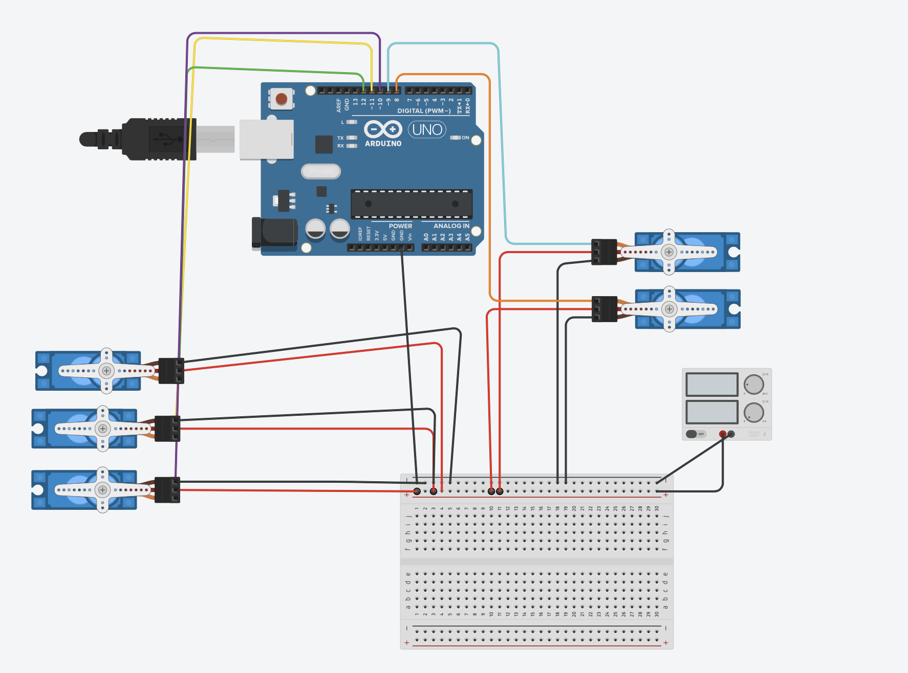

# 5_motors

## Discription

this project was made to create a circuit to control an arm with 5 servo motors and has an initial position of 90 degree

to see the simulation [click here](https://www.tinkercad.com/things/bF627nnI0yl)

## Components
- Arduino Uno R3
- 5 Micro Servos 
- 5v Power Supply 

## Code 
[Here](5_motors1.ino)
